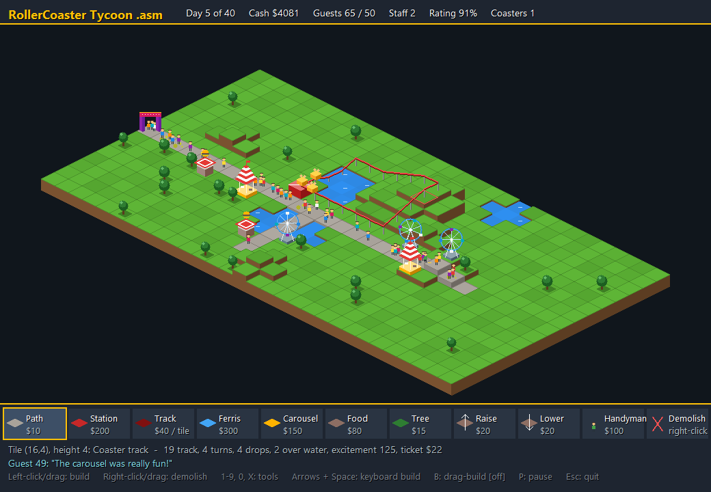

# RollerCoasterTycoon .asm

A small theme-park sim in the spirit of *RollerCoaster Tycoon*, written the way Chris Sawyer wrote the original: in x86 assembly. This one is x86-64 NASM for Windows. It draws its own isometric pixel art into an off-screen bitmap, and the Windows graphics layer (GDI) only draws the text and copies each finished frame to the window.



## Features

- **An isometric park** with terraced hills, lakes with sparkling water, and trees.
- **Roller coasters built from track pieces.** Place a station, then lay track that loops back into it. The coaster follows the terrain, so hills give you drops and track can cross water. Length, turns, drops and splashes decide its excitement, ticket price and how sick it makes people. A train runs laps while guests ride.
- **Flat rides and shops:** Ferris wheels, carousels and food stalls.
- **Guests** pay to get in, walk the paths, and ride whatever is next to the path they're on. They get hungry, bored and queasy, throw up on your paths, and go home when they're broke or miserable.
- **Handymen** walk the paths and sweep up vomit, for a daily wage.
- **Landscaping:** raise and lower the land. Land lowered below sea level floods.
- **Money:** admissions and ticket sales come in, and ride upkeep and staff wages go out every day.
- **A scenario to beat:** have 50 guests in the park at the end of day 40 without going bankrupt.

## Controls

| Input | Action |
| --- | --- |
| Left-click / drag | Build with the current tool |
| Right-click / drag | Demolish, fire a handyman, or clean up vomit |
| Toolbar, or `1`–`9`, `0`, `X` | Pick a tool |
| Arrows / `WASD`, `Space` | Move the cursor and build from the keyboard |
| `B` | Toggle drag-build for keyboard building |
| `P` | Pause |
| `R` | Restart after the scenario ends |
| `Esc` / `Q` | Quit |

| Key | Tool | Cost |
| --- | --- | --- |
| `1` | Path | $10 |
| `2` | Coaster station | $200 |
| `3` | Coaster track | $40 per tile |
| `4` | Ferris wheel | $300 |
| `5` | Carousel | $150 |
| `6` | Food stall | $80 |
| `7` | Tree | $15 |
| `8` | Raise land | $20 |
| `9` | Lower land | $20 |
| `0` | Hire handyman | $100, then $10/day |
| `X` | Demolish | refunds half the cost |

## Tips

- Guests only use attractions **next to the path tile they're standing on**, so build along your paths.
- Guests can only climb **one level at a time**. Paths up a hill need gradual steps.
- A coaster only opens once its track **loops back into the station**. Hover over any piece of track to see why a coaster isn't open, or to see its stats.
- Big drops and long twisty circuits bring in the most money, but also the most vomit. Hire handymen before your paths get disgusting.

## Building

You need:

- [NASM](https://www.nasm.us/)
- Visual Studio with the C++ build tools, which provide the MSVC linker and C runtime

Then run:

```
build.bat
```

This assembles every module in `src\` into `build\` and links `tycoon.exe`. The script expects Visual Studio 18 Community at its default install path. If yours is elsewhere, edit the `vcvars64.bat` line in `build.bat`.

## Project layout

| File | Responsibility |
| --- | --- |
| `src/defs.inc` | Constants, record layouts, macros |
| `src/world.asm` | Game state shared between modules, tile tables, random numbers, tile lookups, the news ticker |
| `src/park.asm` | New game, terrain generation, building, landscaping, hiring |
| `src/sim.asm` | Simulation tick: guests, handymen, admissions, end-of-day accounts |
| `src/coaster.asm` | Finding coaster circuits and rating them |
| `src/raster.asm` | Software rasteriser: spans, isometric blocks, circles, lines |
| `src/park_draw.asm` | Drawing the park back to front, and mouse picking |
| `src/ui.asm` | Header, toolbar, info lines, text, composing each frame |
| `src/input.asm` | Keyboard and mouse |
| `src/main.asm` | Window, message loop, startup |

The whole game is hand-written assembly, following the Windows x64 calling convention. It links against the C runtime for `sprintf`, which formats text, and uses the Win32 API for the window and GDI.

## License

[MIT](LICENSE)
